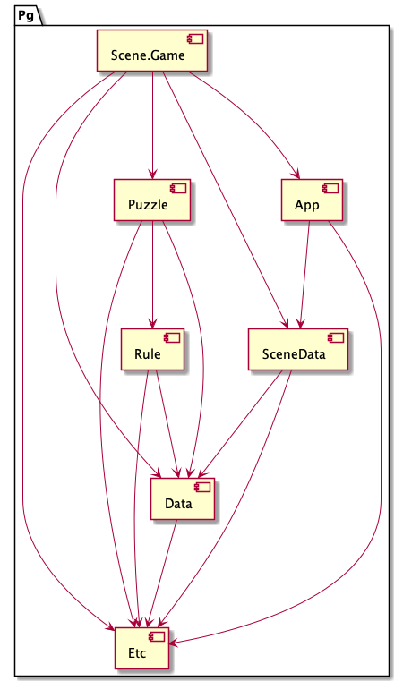

# SUMMARY

# REQUIRES

- DOTween is required
  reference DOTween in asmdef
- UniRx is required
  reference UniRx in asmdef
- UniTask is required
  reference UniTask in asmdef

# TERMS

**TILE**

A hexagon cell.  Tile can contain a gem.

**GEM**

Is in a tile.

When some gems make a cluster as a result of swap operations,
then these gems will vanish.

**CLUSTER**

A group where same colored gems neighbored each other.

**SLIDE**

A phenomenon that gems move to empty tile below.

**VANISH**

A phenomenon that clustered gems disappear.

**TURN**

Is a step of applying a series of gem swaps.

**CHAIN**

A phenomenon that new gem vanished in a turn.

Some new slid gems make a cluster that will vanish.
When new a cluster vanish, this is called chain.

**TOTAL SCORE**

A result value of summation of all *TURN SCORE*s.

**TURN SCORE**

Is calculated from below.

1. *VANISHING CLUSTER SIZE*
2. *CHAIN COUNT*
3. *GEM COLOR TYPE*

**VANISHING CLUSTER SIZE**

A gem count in a cluster.

**CHAIN COUNT**

Explains how much chain is occuring a turn.

**GEM COLOR TYPE**

Consists of,

- Green
- Red
- Purple
- Blue
- Yellow
- Orange
- Rainbow

**STAGE**

Consists from,

- Tile Status Data
- Max Turn Count
- Target Score

**TILE STATUS DATA**

Specifies each tiles has what type of gem, empty, or closed.

**MAX TURN COUNT**

Specifies how many times process turn.

**TARGET SCORE**

Specifies a score to be reached.

# SIMULATOR

## FLOW

1. Initialize tile map
2. Request swap operations
3. Receive simulation response
4. Apply simulation response
5. Back to '2. Request swap operations', and loop this cycle until the game is over

## SIMULATION RESPONSE

UI receives simulation response that as a result of the swap operations.
The simulation response contains,

1. Which the tiles did vanish
2. 

## SLIDING RULE

1. Start testing from bottom right to top left.
2. When empty tile found, test tile above.
2.1 If the tile has no gem, then no operation.  Go next step.
2.2 If the tile has gem, then get the gem from the tile.
3. If the tile still empty, test upper left above, and upper right.
   And do same.
4. If tile that was taken gem is the top of rows,
   new gem will be dropped ito the tile.

## MODULE DESIGN

# REFERENCE

https://www.redblobgames.com/grids/hexagons/
